# Auction system

Terms
In Bidding vs Auction, bidding is when a person makes an offer on an item,
while an auction is the event where many people compete by bidding to buy something.

# How it works

1. Auctions are listed in the `Auctions.json` file
2. Auctions are loaded, then persisted to the db
3. A user can submit a bid against a product
4. After the Auction timer ends, the highest bid is stored against the item

# How to run

1. create a `.env` - see `.example.env`
2. `docker compose up` - start
3. use postman collection to submit bid and get highest bid
4. `docker-compose down -v` - terminate

# How to run tests

1. run `npm i` in terminal
2. npm run test

# Routes

1. `/api/bid/` - submit a bid - `POST`
2. `/api/highest-bid?productId=headset` - get highest bid for item `GET`

# Design

# Improvements

1. Use a message bus with FIFO, dlqs for bids
2. grpc with protobufs
3. Setup performance tests i.e. k6
4. Setup automation tests via cicd, tear down environment
5. Data validation and error handing
